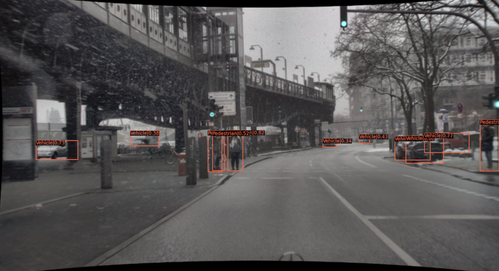
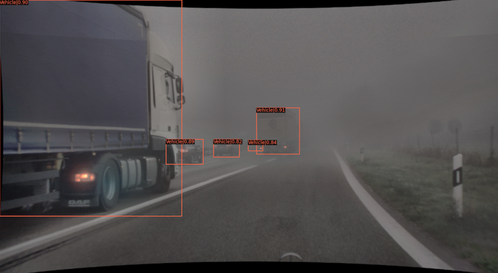
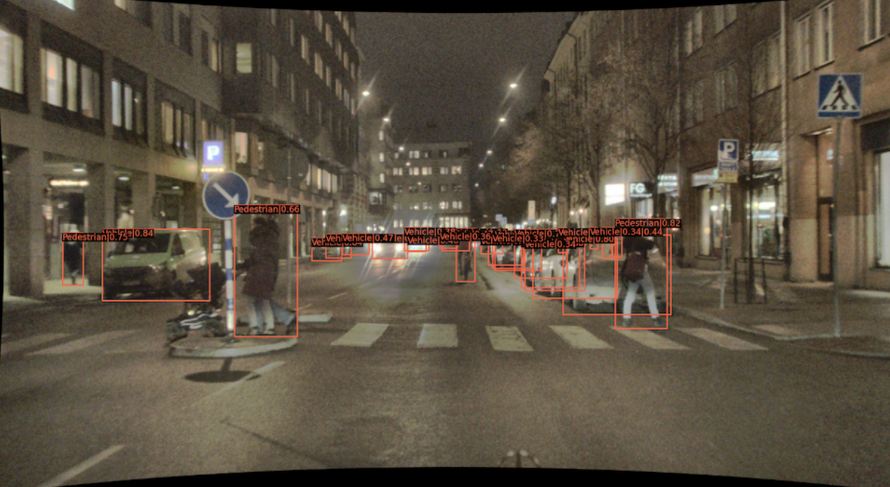
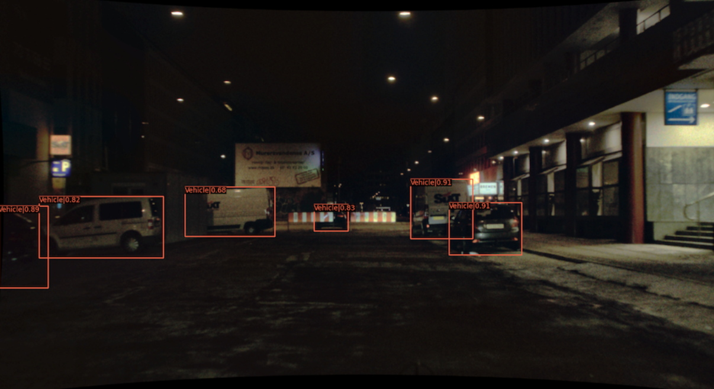
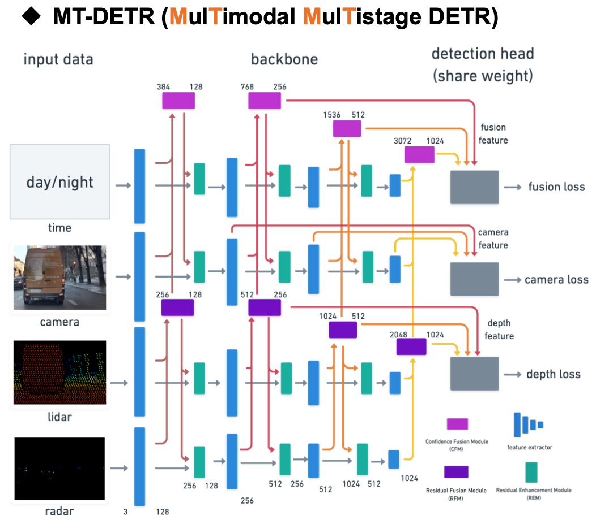
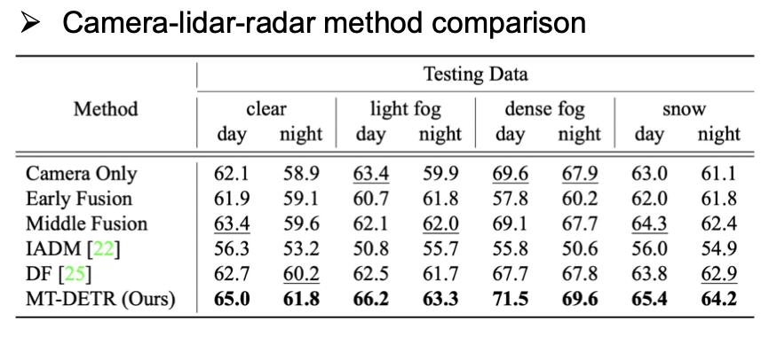
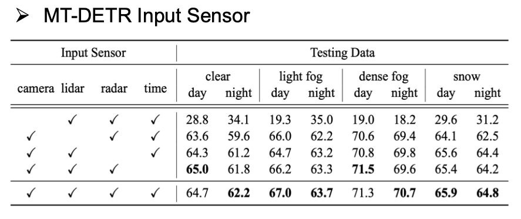

# MT-DETR

This project is the code of **Southeast Missouri State University**  Robust End-to-end Multimodal Detection with Confidence Fusion by *Eashwar Ediga*, *Monesh Venkul Vommi*, *Harish Reddy*. 
<!-- ### Visualized Results in different weathers and times -->

<div align=center>  
 
 
</div>

### Brief Introduction

In the application of autonomous driving, there are times when unexpected and severe weather (fog, snow, night) occurs in outdoor environments, making the detection tasks less effective. Therefore, this Project is about **novel multimodal object detection network called MT-DETR**. It achieves **state-of-the-art performance** using the camera, lidar and radar, and additional time information. The experimental results demonstrate that the MT-DETR is **robust and performs well in various weather conditions**. The **good generalization and scalability** confirm future applicability to different multimodal tasks.

<div align=center>  

</div>

<!-- ### Comparison Tables

<div align=center>  
 
</div> -->


## Getting Started
The repository is based on [mmdetection](https://github.com/open-mmlab/mmdetection) and [cbnetv2](https://github.com/VDIGPKU/CBNetV2). Many thanks for their awesome open-source project.

To run the code:

1. To construct an environment first, please follow the cbnetv2 (https://github.com/VDIGPKU/CBNetV2) and mmdetection (https://github.com/open-mmlab/mmdetection) tutorial.
2. Download the dataset and model checkpoints. Please go to `data/` and `checkpoint/` and read the instructions there to download.
3. After preparation, type the following command in your terminal:
```
bash run_script/${script_name}
```
You can comment training/inference block in shell scripts if you want.

The following are the important directories of this project:

- `data`: download the dataset here
- `checkpoint`: download model weights here
- `run_script`: shell files for running models, change your path and GPU_id here
- `configs`: configs of models, adjust models' setting here
- `mmdet/models/backbones/mt_detr.py`,`mmdet/models/backbones/fusion_module.py`: core model architecture of MT-DETR (this paper)


@InProceedings{Chu_2023_WACV,
    author    = {Eashwar Ediga, Monesh Venkul Vommi, Harish Reddy },
    Project     = {MT-DETR: Robust End-to-End Multimodal Detection With Confidence Fusion},
    month     = {January},
    year      = {2024},
   
}
```
